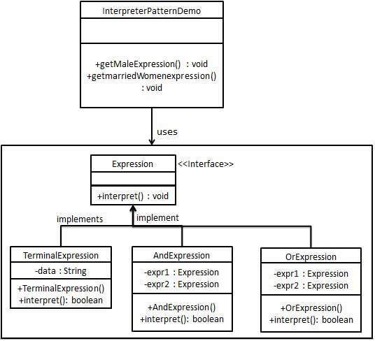

# Interpreter

Interpreter design pattern is one of the **behavioral** design pattern. Interpreter pattern is used to defines a grammatical representation for a language and provides an interpreter to deal with this grammar.

* This pattern involves implementing an expression interface which tells to interpret a particular context. This pattern is used in **SQL** parsing, symbol processing engine etc.
* This pattern performs upon a hierarchy of expressions. Each expression here is a terminal or non-terminal.
* The tree structure of Interpreter design pattern is somewhat similar to that defined by the composite design pattern with terminal expressions being leaf objects and non-terminal expressions being composites.
* The tree contains the expressions to be evaluated and is usually generated by a parser. The parser itself is not a part of the interpreter pattern.

 
 

## Implementation

 

We are going to create an interface *Expression* and concrete classes implementing the *Expression* interface. A class *TerminalExpression* is defined which acts as a main interpreter of context in question. Other classes *OrExpression*, *AndExpression* are used to create combinational expressions.

 

 
 

## Advantages & Disadvantages

 

**Advantages:**

* It’s easy to change and extend the grammar. Because the pattern uses classes to represent grammar rules, you can use inheritance to change or extend the grammar. Existing expressions can be modified incrementally, and new expressions can be defined as variations on old ones.
* Implementing the grammar is easy, too. Classes defining nodes in the abstract syntax tree have similar implementations. These classes are easy to write, and often their generation can be automated with a compiler or parser generator.

**Disadvantages:**

* Complex grammars are hard to maintain. The Interpreter pattern defines at least one class for every rule in the grammar. Hence grammars containing many rules can be hard to manage and maintain.

 
 

## Usage

 

* When the grammar of the language is not complicated.
* When the efficiency is not a priority.