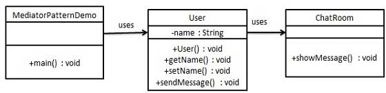

# Mediator

Mediator pattern is used to reduce communication complexity between multiple objects or classes. This pattern provides a mediator class which normally handles all the communications between different classes and supports easy maintenance of the code by loose coupling. Mediator pattern falls under behavioral pattern category.

 
 

## Implementation

 

We are demonstrating mediator pattern by example of a chat room where multiple users can send message to chat room and it is the responsibility of chat room to show the messages to all users. We have created two classes *ChatRoom* and User. User objects will use *ChatRoom* method to share their messages.

*MediatorPatternDemo*, our demo class, will use User objects to show communication between them.

 

 

## Advantages & Disadvantages

 

**Advantages:**

* It limits subclassing. A mediator localizes behavior that otherwise would be distributed among several objects. Changing this behaviour requires subclassing Mediator only, Colleague classes can be reused as is.

**Disadvantages:**

* It centralizes control. The mediator pattern trades complexity of interaction for complexity in the mediator. Because a mediator encapsulates protocols, it can become more complex than any individual colleague. This can make the mediator itself a monolith that’s hard to maintain

 
 

## Usage

 

 * Use the Mediator pattern when it’s hard to change some of the classes because they are tightly coupled to a bunch of other classes.
 * Use the pattern when you can’t reuse a component in a different program because it’s too dependent on other components.
 * Use the Mediator when you find yourself creating tons of component subclasses just to reuse some basic behavior in various contexts.