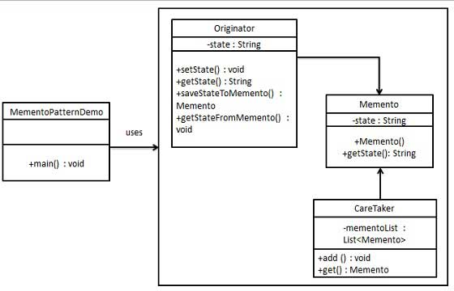

# Memento

**Memento pattern** is used to restore state of an object to a previous state. It is also known as **snapshot pattern**.

A memento is is like a restore point during the life cycle on the object, which the client application can use to restore the object state to its state. Conceptually, it is very much like we create restore points for operating systems and use to restore the system if something breaks or system crashes.

 

## Implementation

 

Memento pattern uses three actor classes. Memento contains state of an object to be restored. Originator creates and stores states in Memento objects and Caretaker object is responsible to restore object state from Memento. We have created classes Memento, Originator and CareTaker.

MementoPatternDemo, our demo class, will use CareTaker and Originator objects to show restoration of object states.

* **Originator :** The object for which the state is to be saved. It creates the memento and uses it in future to undo.
* **Memento :** The object that is going to maintain the state of originator. Its just a POJO.
* **Caretaker :** The object that keeps track of multiple memento. Like maintaining savepoints.

 

## Advantages & Disadvantages

**Advantages:**

* The biggest advantage is that you can always discard the unwanted changes and restore it to an intended or stable state.
* You do not compromise the encapsulation associated with the key objects that are participating in this model.
* Maintains high cohesion.
* Provides an easy recovery technique.

**Disadvantages:**

* A high number of mementos require more storage. At the same time, they put additional burdens on a caretaker.
* It also increases maintenance costs in parallel because code efforts needs to be made to manage memento classes as well.
* The additional time to save the states decreases the overall performance of the system.

 

## Usage

 

* It is used in Undo and Redo operations in most software.
* It is used in database transactions.

* A memento can also be used in applications which must be restarted from their last known working state or draft. An example of this can be an IDE which restart from changes, user made before closing the IDE.