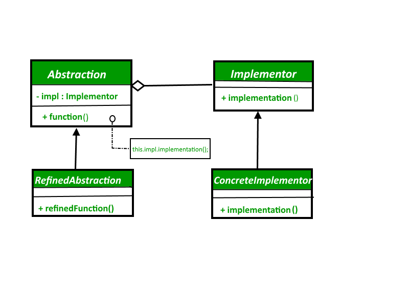

# Bridge

The Bridge design pattern allows you to separate the abstraction from the implementation. It is a structural design pattern. 

**There are 2 parts in Bridge design pattern :**

1. Abstraction
2. Implementation

This is a design mechanism that encapsulates an implementation class inside of an interface class.

* The bridge pattern allows the Abstraction and the Implementation to be developed independently and the client code can access only the
* Abstraction part without being concerned about the Implementation part.
The abstraction is an interface or abstract class and the implementer is also an interface or abstract class.
* The abstraction contains a reference to the implementer. Children of the abstraction are referred to as refined abstractions, and children of the implementer are concrete implementers. Since we can change the reference to the implementer in the abstraction, we are able to change the abstraction’s implementer at run-time. Changes to the implementer do not affect client code.
* It increases the loose coupling between class abstraction and it’s implementation.

 

## Implementation

 

**Elements of Bridge Design Pattern**

* **Abstraction** – core of the bridge design pattern and defines the crux. Contains a reference to the implementer.
* **Refined Abstraction** – Extends the abstraction takes the finer detail one level below. Hides the finer elements from implementers.
* **Implementer** – It defines the interface for implementation classes. This interface does not need to correspond directly to the abstraction interface and can be very different. Abstraction imp provides an implementation in terms of operations provided by the Implementer interface.
* **Concrete Implementation** – Implements the above implementer by providing the concrete implementation.

 

## Advantages & Disadvantages

 

**Advantages:**

1. Bridge pattern decouple an abstraction from its implementation so that the two can vary independently.
2. It is used mainly for implementing platform independence features.
3. It adds one more method level redirection to achieve the objective.
4. Publish abstraction interface in a separate inheritance hierarchy, and put the implementation in its own inheritance hierarchy.
5. Use bridge pattern to run-time binding of the implementation.
6. Use bridge pattern to map orthogonal class hierarchies
7. Bridge is designed up-front to let the abstraction and the implementation vary independently.

**Disadvantages:**

1. The Bridge Design Pattern divides a big class that contains both the abstraction and the implementation into two separate class hierarchies. Hence, we need to manage two different classes along with their subclasses instead of one big class, thereby increasing the code complexity.
2. It could negatively affect the performance of the application because of the indirection of the request from the Abstraction to the Implementor.
3. When we have multiple interfaces with minimal or a single implementation, it becomes difficult to manage this pattern.

 

## Usage

 

* When you don't want a permanent binding between the functional abstraction and its implementation.
* When both the functional abstraction and its implementation need to extended using sub-classes.
* It is mostly used in those places where changes are made in the implementation does not affect the clients.
* The Bridge pattern is especially useful when dealing with cross-platform apps, supporting multiple types of database servers or working with several API providers of a certain kind (for example, cloud platforms, social networks, etc.)