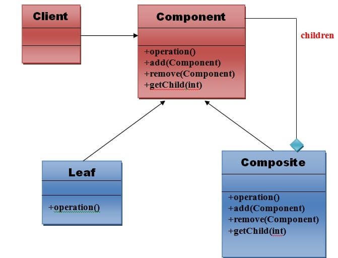

# Composite

In programming languages, composite normally used with tree structures.

Java composite design pattern comes under structural design patterns and it provides the facility to compose objects into tree structures to represent part-whole hierarchies i.e. individual and composite objects will be treated uniformly.

 

## Implementation

 

The Composite Pattern has four participants:

1. **Component –** Component declares the interface for objects in the composition and for accessing and managing its child components. It also implements default behavior for the interface common to all classes as appropriate.
2. **Leaf –** Leaf defines behavior for primitive objects in the composition. It represents leaf objects in the composition.
3. **Composite –** Composite stores child components and implements child related operations in the component interface.
4. **Client –** Client manipulates the objects in the composition through the component interface.

 

## Advantages & Disadvantages

 

**Advantages:**
* It defines class hierarchies that contain primitive and complex objects.
* It makes easier to you to add new kinds of components.
* It provides flexibility of structure with manageable class or interface.

**Disadvantages:**

* Once tree structure is defined, the composite design makes the tree overly general.
* In specific cases, it is difficult to restrict the components of the tree to only particular types.
* Therefore, to enforce such constraint, the program must rely on run-time checks, since it cannot use the type system the of programming language.

 

## Usage

 

>When to use Composite Design Pattern?

Composite Pattern should be used when clients need to ignore the difference between compositions of objects and individual objects. If programmers find that they are using multiple objects in the same way, and often have nearly identical code to handle each of them, then composite is a good choice, it is less complex in this situation to treat primitives and composites as homogeneous.

1. Less number of objects reduces the memory usage, and it manages to keep us away from errors related to memory like <u>java.lang.OutOfMemoryError</u>.
2. Although creating an object in Java is really fast, we can still reduce the execution time of our program by sharing objects.

>When not to use Composite Design Pattern?

1. Composite Design Pattern makes it harder to restrict the type of components of a composite. So it should not be used when you don’t want to represent a full or partial hierarchy of objects.
2. Composite Design Pattern can make the design overly general. It makes harder to restrict the components of a composite. Sometimes you want a composite to have only certain components. With Composite, you can’t rely on the type system to enforce those constraints for you. Instead you’ll have to use run-time checks.