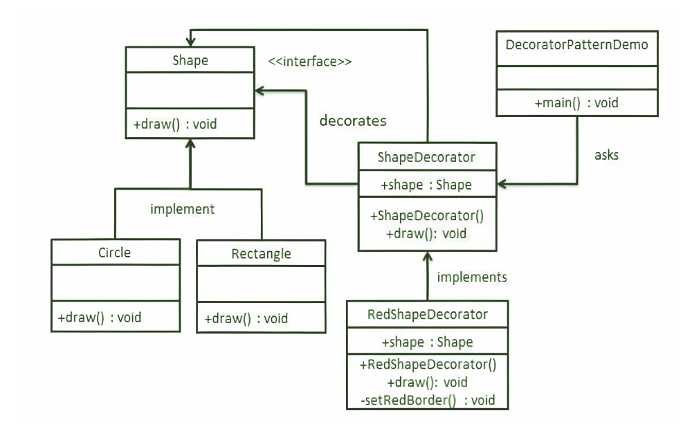

# Decorator

**Decorator design pattern** allows us to dynamically add functionality and behavior to an object without affecting the behavior of other existing objects within the same class. We use inheritance to extend the behavior of the class. This takes place at compile-time, and all the instances of that class get the extended behavior.

* Decorator patterns allow a user to add new functionality to an existing object without altering its structure. So, there is no change to the original class.
* The decorator design pattern is a structural pattern, which provides a wrapper to the existing class.
* The decorator design pattern uses abstract classes or interfaces with the composition to implement the wrapper.
* Decorator design patterns create decorator classes, which wrap the original class and supply additional functionality by keeping the class methods’ signature unchanged.
* Decorator design patterns are most frequently used for applying single responsibility principles since we divide the functionality into classes with unique areas of concern.
* The decorator design pattern is structurally almost like the chain of responsibility pattern.

 

## Implementation

 

We’re going to create a Shape interface and concrete classes implementing the Shape interface. We will then create an abstract decorator class ShapeDecorator implementing the Shape interface and having the Shape object as its instance variable.

1. ‘Shape’ is the name of the interface
2. ‘Rectangle’ class and ‘Circle’ class will be concrete classes implementing the ‘Shape’ interface.
3. ‘ShapeDecorator’ is our abstract decorator class implementing the same ‘Shape’ interface.
4. RedShapeDecorator is a concrete class implementing ShapeDecorator.
5. DecoratorPatternDemo, our demo class will use RedShapeDecorator to decorate Shape objects.

 

## Advantages & Disadvantages

 

**Advantages:**

* A decorator design pattern provides a high degree of flexibility as an alternative to subclassing for functionality extension.
* Instead of editing the existing code, decorators allow behaviour modification at runtime.
* Problems with permutation are resolved. Wrapping an object in numerous decorators allows you to mix multiple behaviours.
* The decorator design pattern adheres to the concept that classes should be extensible but not modifiable.
* Decorator pattern follows the Single responsibility principle which states that a monolithic class with multiple tasks can be broken down into various classes, each with a particular responsibility or task.

**Disadvantages:**

* Decorators might result in a lot of small elements in our design, which can be difficult to manage.
* This design pattern is not beginner-friendly.
* Debugging is quite difficult because of the extended decorator components.
* The architecture may have very high complexity, especially due to the decorator interface.

 

## Usage

 

<pre>
<li>We want to assign responsibilities to objects transparently and dynamically without affecting the other objects.
<li>We want to give an object duty that you might wish to change in the future.
<li>Sub-classing is no longer a viable method of extending functionality.
<li>We need to add extra behaviors to objects at runtime without disturbing the code that uses them and use the Decorator approach.
<li>It’s inconvenient or impossible to extend an object’s behavior using inheritance. Use the pattern.
</pre>