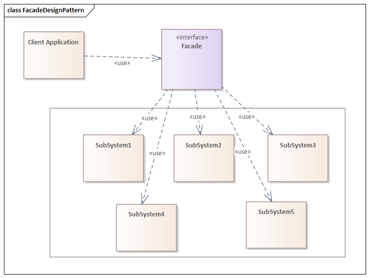

# Facade

Facade pattern hides the complexities of the system and provides an interface to the client using which the client can access the system. This type of design pattern comes under structural pattern as this pattern adds an interface to existing system to hide its complexities.

This pattern involves a single class which provides simplified methods required by client and delegates calls to methods of existing system classes.

 

## Implementation

 

 

## Advantages & Disadvantages

 

**Advantages:**

* It protects customers from the sub-system components’ intricacies.
* It encourages subsystems and clients to be loosely coupled.

**Disadvantages:**

* Apart from building a complex structure, there are no obvious disadvantages to the Facade design pattern.

 

## Usage

 

<pre>
<li>When you have a sophisticated system that you wish to expose to clients simply, or when you want to create an external communication layer over an existing system that is incompatible with the system, the facade pattern is ideal. 
<li>Facade is concerned with user interfaces rather than implementation. Its goal is to disguise internal complexity behind a single, simple-looking interface on the outside.
<li>When there are several dependencies between clients and an abstraction’s implementation classes.
</pre>